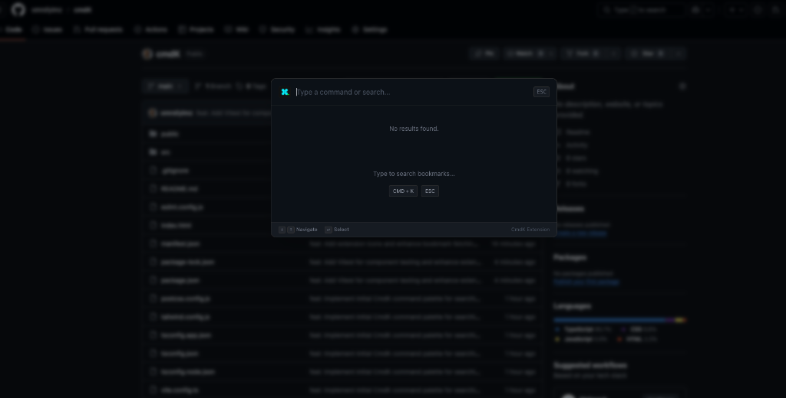

# ⌘ cmdK - Chrome Extension Command Palette

**cmdK** is a powerful, keyboard-centric command palette for Chrome. It injects a modern, Spotlight-like interface into every web page, allowing you to instantly search your bookmarks, open tabs (planned), and perform Google searches without lifting your fingers from the keyboard.

## ✨ Features

-   **⚡️ Instant Access**: Trigger with `Cmd+K` (macOS) or `Ctrl+K` (Windows/Linux) on any page.
-   **🔖 Bookmark Search**: Real-time fuzzy search across all your Chrome bookmarks.
-   **🔍 Google Search Integration**: Fallback to Google Search directly from the palette if you can't find what you need.
-   **🎨 Modern UI**: Beautiful dark mode design, pixel-perfect rendering, and polished animations.
-   **🛡️ Encapsulated Styles**: Uses **Shadow DOM** to ensure the extension's styles never conflict with the website you are visiting.
-   **🎬 YouTube Mode**: Smart event handling lets you use `Cmd+K` even on sites with aggressive keyboard shortcuts like YouTube.

## 🚀 Installation (Developer Mode)

Since this is a custom extension, you need to load it in Developer Mode:

1.  **Clone or Download** this repository.
2.  Open your terminal and run:
    ```bash
    npm install
    npm run build
    ```
    This will generate a `dist` folder.
3.  Open Chrome and navigate to `chrome://extensions`.
4.  Enable **Developer mode** (top right toggle).
5.  Click **Load unpacked**.
6.  Select the `dist` folder created in step 2.

## 📖 Usage

| Action | Shortcut |
| :--- | :--- |
| **Open Palette** | `Cmd + K` (Mac) or `Ctrl + K` (Win) |
| **Close Palette** | `ESC` or Click outside |
| **Navigate** | `↑` / `↓` Arrows |
| **Select / Go** | `Enter` |
| **Search Google** | Type query + `Enter` |

## 🏗️ Architecture

CmdK uses a modern React + Vite + TypeScript stack. It leverages **Shadow DOM** for complete style isolation and **Manifest V3** for security and performance.



### Key Components

*   **`src/content/index.tsx`**: The entry point. Creates a host `div` in `document.documentElement`, attaches a Shadow DOM, and injects the styles and React app.
*   **`src/components/CommandMenu.tsx`**: The core UI logic. Handles key events (`keydown`), manages state (`open`, `search`, `items`), and communicates with the background script.
*   **`src/background/index.ts`**: A lightweight service worker that acts as a bridge between the content script and privileged Chrome APIs (like `bookmarks`).
*   **`manifest.json`**: Configuration file defining permissions (`bookmarks`, `activeTab`) and script injection rules.

## 🛠️ Development

### Prerequisites
- Node.js (v16+)
- npm

### Commands

*   `npm run dev`: Start Vite dev server (mostly for UI dev in isolation).
*   **`npm run build`**: Prod build. **Must run this to update the extension.**
*   `npm run test`: Run unit tests with Vitest.

### Safe Event Handling
We use `window.addEventListener('keydown', ..., true)` with `e.stopImmediatePropagation()` to ensure `Cmd+K` works even on sites that try to hijack keyboard events (e.g., YouTube, GitHub, Google Sheets).

## 🧪 Testing

The project includes unit tests for the critical UI components.
Run the tests with:

```bash
npx vitest run
```

---
*Built with ❤️ using React, TailwindCSS, & Vite.*
